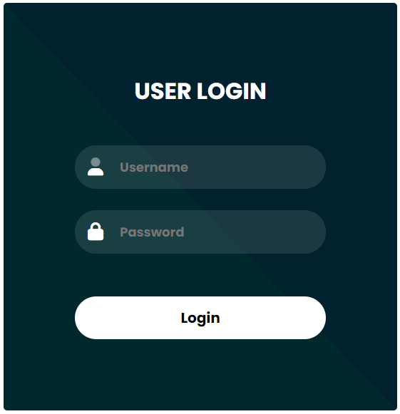

# LoginForm Repository

This repository contains multiple versions of a login form. Each version has unique features and improvements.

## Versions

### Version 1.0 - Simple Login Form
#### Features
- Basic login form
- Created with HTML and CSS

<a href="https://codebyfaisal.github.io/Loginform/simpleloginform" target="_blank">Preview</a>

### Version 2.0 - Login and Registration Form with Toggle Feature
#### Features
- Login and registration forms
- Created with HTML, CSS, and JavaScript
- Responsive design
- Toggle feature to switch between login and registration forms

<a href="https://codebyfaisal.github.io/Loginform/login-registration-form" target="_blank">Preview</a>

## Usage

To use any version of the login form, simply clone this repository or copy the code from the respective folders (`simpleloginform` or `login-registration-form`).

If you have any questions or suggestions, feel free to reach out.

Happy Coding! 🚀